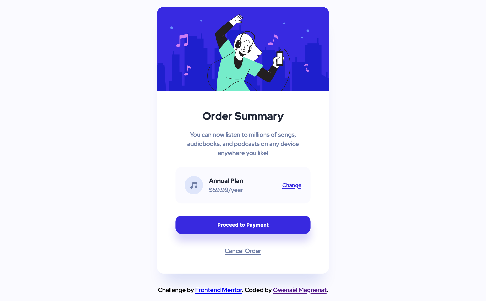

# Frontend Mentor - Order summary card solution

This is a solution to the [Order summary card challenge on Frontend Mentor](https://www.frontendmentor.io/challenges/order-summary-component-QlPmajDUj). Frontend Mentor challenges help you improve your coding skills by building realistic projects.

## Table of contents

- [Overview](#overview)
  - [The challenge](#the-challenge)
  - [Screenshot](#screenshot)
  - [Links](#links)
- [My process](#my-process)
  - [Built with](#built-with)
  - [What I learned](#what-i-learned)
  - [Continued development](#continued-development)
- [Author](#author)

## Overview

### The challenge

Users should be able to:

- See hover states for interactive elements

### Screenshot

### Links

- Solution URL: [Add solution URL here](https://your-solution-url.com)
- Live Site URL: [Add live site URL here](https://your-live-site-url.com)

## My process

### Built with

- Semantic HTML5 markup
- SCSS variables
- Flexbox
- CSS Grid
- Mobile-first workflow

### What I learned

How to plan ahead my variables before jumping in the code. How to analyze the design and build a system with colors, font-weights, spacing that allow me to quickly build the layout and update it.

### Continued development

Dig further in scss functions, extends and mixins. Keep working on the variable naming system to make it transferable easily between projects.

## Author

- Website - [Gwenaël Magnenat](https://www.linkedin.com/in/gmagnenat/)
- Frontend Mentor - [@gmagnenat](https://www.frontendmentor.io/profile/gmagnenat)
- Twitter - [@magnenatg](https://www.twitter.com/magnenatg)
